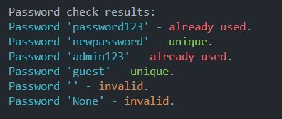
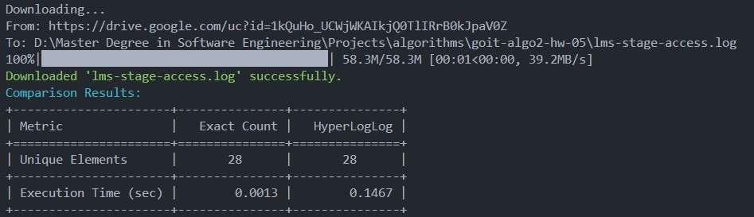

# Task 1: Bloom Filter Password Uniqueness Checker

This project implements a Bloom Filter to efficiently check the uniqueness of passwords without storing the actual passwords. It allows you to quickly determine if a password was used before, using minimal memory.

## Features

- **BloomFilter class**: Implements a Bloom Filter with customizable size and number of hash functions.
- **check_password_uniqueness function**: Checks a list of passwords against the Bloom Filter and returns their uniqueness status.
- Handles invalid inputs (e.g., empty strings, None).
- Automatically adds new unique passwords to the Bloom Filter for future checks.
- Uses `mmh3` (MurmurHash3) for hashing and `bitarray` for compact bit storage.
- Colored console output with `colorama` for clear status visualization.

## Installation

Make sure you have Python 3.6+ installed.

Install required dependencies:

```bash
pip install bitarray mmh3 colorama
python bloom_filter.py
```

## Results




---
# Task 2: Performance Comparison: Exact Unique Count vs HyperLogLog

This Python script compares the performance and accuracy of two methods for counting unique IP addresses in a log file:

- **Exact counting** using Python's built-in `set`
- **Approximate counting** using the HyperLogLog algorithm (`datasketch` library)

Additionally, the script can automatically download the log file from Google Drive if it's not found locally.

## Features

- Loads IP addresses from a log file, ignoring malformed lines and validating IPs.
- Computes exact unique IP count.
- Computes approximate unique IP count using HyperLogLog with configurable precision.
- Measures and compares execution time of both methods.
- Outputs results in a formatted table with colored terminal output.
- Automatically downloads the log file from Google Drive by file ID if not present locally.

## Requirements

- Python 3.6+
- Install dependencies with:

```bash
pip install datasketch tabulate colorama gdown
python performance_comparison.py
```

## Results


